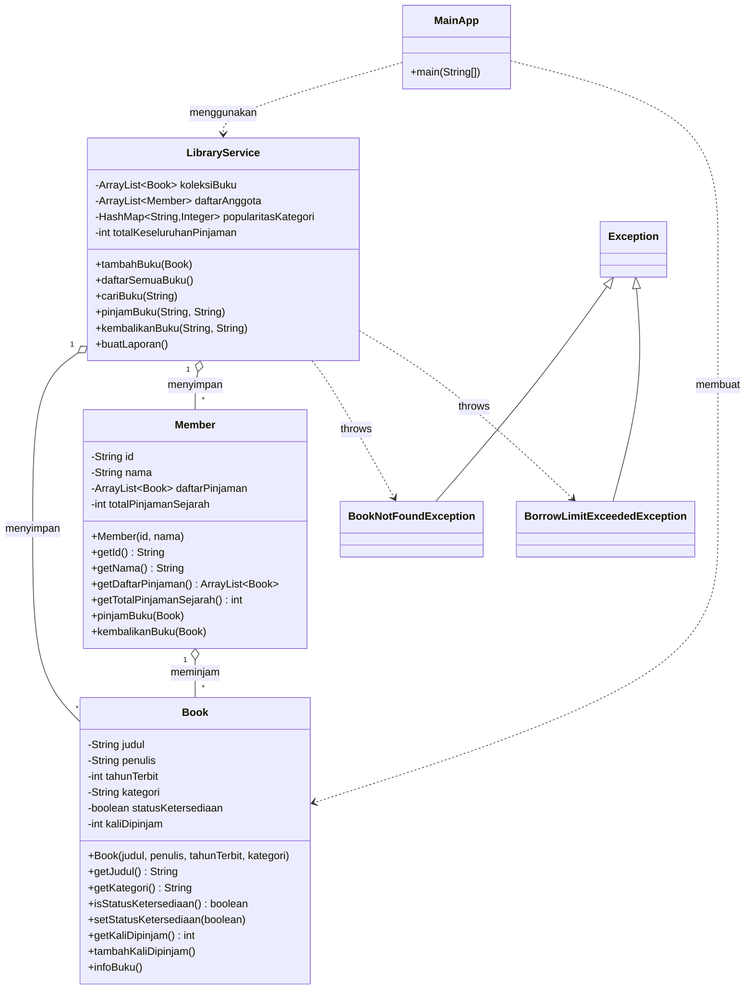
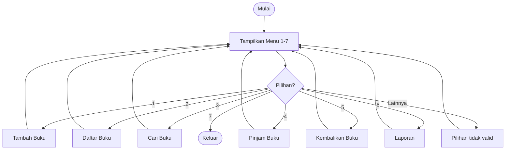
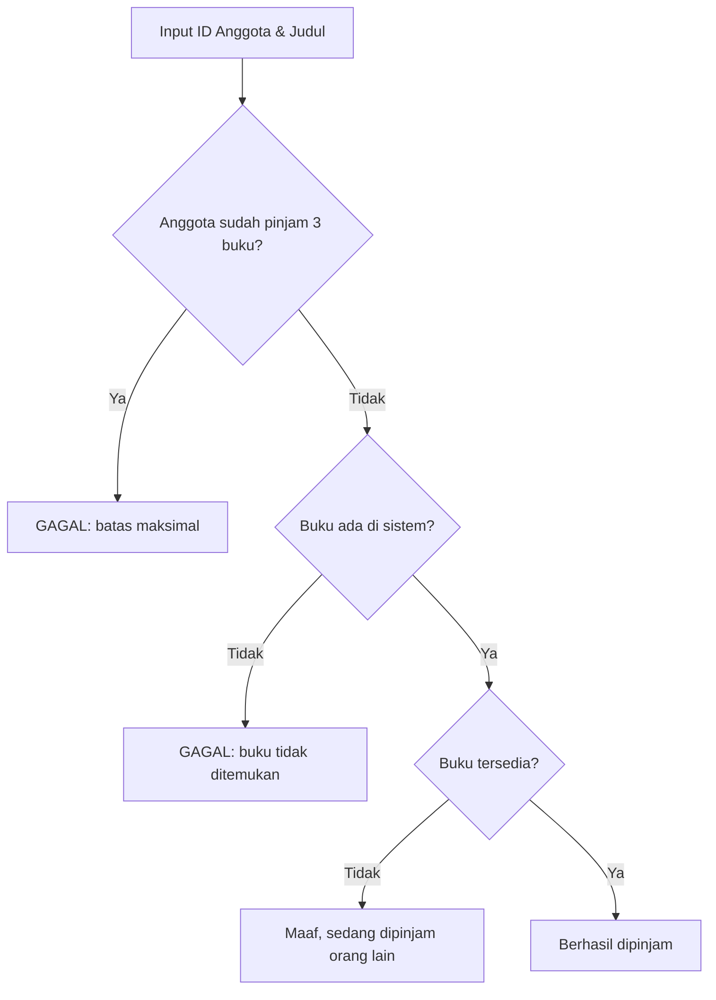

# 📚 Sistem Manajemen Perpustakaan Mini

Aplikasi perpustakaan sederhana berbasis **Java (console/terminal)** yang dibuat untuk tugas **Praktikum Pemrograman Berorientasi Objek (PBO)**. Dengan aplikasi ini kita bisa menambah buku, mencari buku, meminjam, mengembalikan, dan melihat laporan analisis perpustakaan.


---

## 📑 Daftar Isi

1. [Identitas](#-identitas)
2. [Deskripsi Program](#-deskripsi-program)
3. [Fitur Utama](#-fitur-utama)
4. [Konsep PBO & Java yang Digunakan](#-konsep-pbo--java-yang-digunakan)
5. [Struktur Proyek](#-struktur-proyek)
6. [Diagram Kelas](#-diagram-kelas)
7. [Penjelasan Setiap Kelas](#-penjelasan-setiap-kelas)
8. [Alur Kerja Program](#-alur-kerja-program)
9. [Cara Menjalankan Program](#-cara-menjalankan-program)
10. [Contoh Output Program](#-contoh-output-program)
11. [Penjelasan Output Langkah demi Langkah](#-penjelasan-output-langkah-demi-langkah)
12. [Catatan & Ide Pengembangan](#-catatan--ide-pengembangan)

---

## 👤 Identitas

| Keterangan   | Isi                                   |
| ------------ | ------------------------------------- |
| Nama         | *(isi nama kamu)*                     |
| NIM          | *(isi NIM kamu)*                      |
| Kelas        | *(isi kelas kamu)*                    |
| Mata Kuliah  | Praktikum Pemrograman Berorientasi Objek |

---

## 📖 Deskripsi Program

**Sistem Manajemen Perpustakaan Mini** adalah program berbasis teks (tanpa tampilan grafis) yang berjalan di terminal. Pengguna memilih menu dengan mengetik angka **1–7**, lalu program memproses pilihan tersebut.

Program ini sudah menyediakan **2 anggota contoh** supaya fitur peminjaman bisa langsung dicoba:

| ID Anggota | Nama |
| ---------- | ---- |
| `M01`      | Budi |
| `M02`      | Siti |

Data disimpan **di memori (RAM)** saja, jadi setiap program ditutup, semua data buku dan peminjaman akan hilang dan mulai dari awal lagi.

---

## ✨ Fitur Utama

| No | Menu | Penjelasan Singkat |
| -- | ---- | ------------------ |
| 1 | **Tambah Buku** | Menambahkan buku baru (judul, penulis, tahun terbit, kategori). |
| 2 | **Daftar Buku** | Menampilkan semua buku beserta statusnya (Tersedia / Dipinjam). |
| 3 | **Cari Buku** | Mencari buku berdasarkan **judul atau kategori** (tidak peduli huruf besar/kecil). |
| 4 | **Pinjam Buku** | Anggota meminjam buku. Maksimal **3 buku** sekaligus per anggota. |
| 5 | **Kembalikan Buku** | Anggota mengembalikan buku yang sedang dipinjam. |
| 6 | **Laporan Perpustakaan** | Menampilkan analisis: total peminjaman, buku terpopuler, anggota teraktif, dan kategori paling diminati. |
| 7 | **Keluar** | Menutup program. |

---

## 🧠 Konsep PBO & Java yang Digunakan

Tugas ini menerapkan beberapa materi penting dalam Java dan PBO. Berikut penjelasannya beserta lokasi penerapannya:

| Konsep | Penjelasan Mudah | Contoh di Kode |
| ------ | ---------------- | -------------- |
| **Class & Object** | Class adalah "cetakan", object adalah hasil cetakannya. | `Book`, `Member`, `LibraryService` |
| **Encapsulation** | Atribut dibuat `private`, diakses lewat getter/setter agar data lebih aman. | Semua atribut di `Book` dan `Member` |
| **Constructor** | Method khusus yang otomatis jalan saat object dibuat. | `Book(...)`, `Member(...)`, `LibraryService()` |
| **Tipe data primitive & reference** | Primitive: `int`, `boolean`. Reference: `String`, `ArrayList`, object. | `tahunTerbit` (int), `statusKetersediaan` (boolean), `judul` (String) |
| **Manipulasi Character & String** | Mengubah/memeriksa teks dengan `Character.toUpperCase()`, `charAt()`, `substring()`, `toLowerCase()`, `contains()`, `equalsIgnoreCase()`. | Constructor `Book` dan method `cariBuku()` |
| **Collection (ArrayList)** | Menyimpan banyak data dalam satu daftar yang ukurannya fleksibel. | `koleksiBuku`, `daftarAnggota`, `daftarPinjaman` |
| **Collection (HashMap)** | Menyimpan data berpasangan *kunci → nilai*. | `popularitasKategori` (kategori → jumlah dipinjam) |
| **Perulangan (Looping)** | Mengulang proses, dipakai `for-each` dan `while`. | Menampilkan buku, mencari anggota, menu utama |
| **Percabangan** | `if-else` dan `switch-case` untuk memilih aksi. | Menu di `MainApp`, pengecekan di `LibraryService` |
| **Custom Exception** | Membuat jenis error sendiri agar pesan kesalahan lebih jelas. | `BookNotFoundException`, `BorrowLimitExceededException` |
| **Exception Handling** | Menangani error dengan `try-catch` agar program tidak langsung berhenti. | `case 4` di `MainApp` |
| **Assertion** | Pemeriksaan kondisi "yang seharusnya selalu benar" saat pengembangan. | `assert anggota != null` di `pinjamBuku()` |
| **Package** | Mengelompokkan class agar rapi. | `library.model`, `library.service`, `library.exception`, `library.main` |

---

## 🗂 Struktur Proyek

Kode dibagi ke dalam 4 package supaya rapi dan mudah dicari:

```
PraktikumPBO
└── src/main/java/library
    ├── exception
    │   ├── BookNotFoundException.java
    │   └── BorrowLimitExceededException.java
    ├── main
    │   └── MainApp.java
    ├── model
    │   ├── Book.java
    │   └── Member.java
    └── service
        └── LibraryService.java
```

| Package | Isi | Fungsi |
| ------- | --- | ------ |
| `library.model` | `Book`, `Member` | Mewakili **data** (buku dan anggota). |
| `library.service` | `LibraryService` | Berisi **logika bisnis** (tambah, cari, pinjam, kembalikan, laporan). |
| `library.exception` | 2 class exception | Mendefinisikan **error khusus** perpustakaan. |
| `library.main` | `MainApp` | **Titik masuk program** (`main`) dan tampilan menu. |

---

## 🧩 Diagram Kelas



---

## 🔍 Penjelasan Setiap Kelas

### 1. `Book.java` (package `library.model`)

Mewakili **satu buku** di perpustakaan.

| Atribut | Tipe | Keterangan |
| ------- | ---- | ---------- |
| `judul` | `String` | Judul buku |
| `penulis` | `String` | Nama penulis |
| `tahunTerbit` | `int` | Tahun buku terbit |
| `kategori` | `String` | Kategori buku (Sains, Sejarah, dll.) |
| `statusKetersediaan` | `boolean` | `true` = tersedia, `false` = sedang dipinjam |
| `kaliDipinjam` | `int` | Berapa kali buku ini pernah dipinjam (untuk laporan) |

**Hal menarik di constructor:** kategori otomatis dirapikan sehingga **huruf pertama kapital dan sisanya kecil**.

```java
char hurufPertama = Character.toUpperCase(kategori.charAt(0));
this.kategori = hurufPertama + kategori.substring(1).toLowerCase();
```

Contoh: `sAINS`, `SAINS`, atau `sains` semuanya menjadi **`Sains`**. Jika kategori dikosongkan, maka otomatis diisi **`Umum`**. Saat buku baru dibuat, statusnya selalu **Tersedia** dan `kaliDipinjam` bernilai 0.

Method `infoBuku()` mencetak satu baris informasi buku, contoh:
```
- belajar java | budi (2023) | Kategori: Sains | Status: Tersedia
```

---

### 2. `Member.java` (package `library.model`)

Mewakili **satu anggota** perpustakaan.

| Atribut | Tipe | Keterangan |
| ------- | ---- | ---------- |
| `id` | `String` | ID anggota (contoh: `M01`) |
| `nama` | `String` | Nama anggota |
| `daftarPinjaman` | `ArrayList<Book>` | Buku yang **sedang** dipinjam saat ini |
| `totalPinjamanSejarah` | `int` | Total buku yang **pernah** dipinjam (tidak berkurang saat dikembalikan) |

- `pinjamBuku(Book)` → menambahkan buku ke `daftarPinjaman` dan menambah `totalPinjamanSejarah`.
- `kembalikanBuku(Book)` → menghapus buku dari `daftarPinjaman`.

> 💡 `daftarPinjaman` dipakai untuk **batas peminjaman** (maks. 3 buku), sedangkan `totalPinjamanSejarah` dipakai untuk **laporan anggota teraktif**.

---

### 3. `BookNotFoundException.java` & `BorrowLimitExceededException.java` (package `library.exception`)

Dua class **exception buatan sendiri**, keduanya turunan dari `Exception`.

| Exception | Kapan Dilempar (`throw`) |
| --------- | ------------------------ |
| `BookNotFoundException` | Saat judul buku yang ingin dipinjam **tidak ada** di sistem. |
| `BorrowLimitExceededException` | Saat anggota **sudah meminjam 3 buku** dan mencoba meminjam lagi. |

Keduanya menerima pesan (`message`) yang nanti ditampilkan ke pengguna.

---

### 4. `LibraryService.java` (package `library.service`)

**Otak dari program.** Semua aturan dan proses perpustakaan ada di sini.

| Atribut | Fungsi |
| ------- | ------ |
| `koleksiBuku` | Daftar semua buku (`ArrayList<Book>`) |
| `daftarAnggota` | Daftar semua anggota (`ArrayList<Member>`) |
| `popularitasKategori` | `HashMap` yang mencatat kategori → berapa kali dipinjam |
| `totalKeseluruhanPinjaman` | Total transaksi peminjaman |

| Method | Cara Kerja |
| ------ | ---------- |
| `tambahBuku(Book)` | Memasukkan buku ke `koleksiBuku` lalu menampilkan pesan sukses. |
| `daftarSemuaBuku()` | Jika kosong, tampil pesan "Belum ada buku". Jika ada, memanggil `infoBuku()` tiap buku. |
| `cariBuku(String)` | Mengubah judul/kategori & kata kunci ke huruf kecil lalu memakai `contains()`. Jadi **pencarian tidak sensitif huruf besar/kecil** dan **cukup sebagian kata**. |
| `cariAnggota(String)` *(private)* | Mencari anggota berdasarkan ID (`equalsIgnoreCase`, jadi `m01` = `M01`). Mengembalikan `null` jika tidak ada. |
| `pinjamBuku(id, judul)` | Proses peminjaman (lihat penjelasan di bawah). |
| `kembalikanBuku(id, judul)` | Mengembalikan buku milik anggota dan mengubah statusnya menjadi tersedia lagi. |
| `buatLaporan()` | Menghitung dan menampilkan analisis perpustakaan. |

**Urutan pengecekan di `pinjamBuku()`:**

1. Cari anggota berdasarkan ID → dicek dengan **assertion** (`assert anggota != null`).
2. Cek batas pinjam → jika sudah **3 buku** → lempar `BorrowLimitExceededException`.
3. Cari buku berdasarkan judul → jika tidak ada → lempar `BookNotFoundException`.
4. Cek ketersediaan → jika sedang dipinjam orang lain → tampil pesan maaf dan proses berhenti.
5. Jika semua lolos → status buku jadi **Dipinjam**, `kaliDipinjam` +1, buku masuk ke daftar pinjaman anggota, total peminjaman +1, dan popularitas kategori dicatat di `HashMap`.

**Cara `buatLaporan()` bekerja:** program melakukan perulangan untuk mencari nilai terbesar.
- **Buku terpopuler** → buku dengan `kaliDipinjam` tertinggi.
- **Anggota teraktif** → anggota dengan `totalPinjamanSejarah` tertinggi.
- **Kategori paling diminati** → kategori dengan nilai tertinggi di `HashMap`.

Baris laporan hanya ditampilkan bila datanya ada (minimal sudah ada 1 peminjaman).

---

### 5. `MainApp.java` (package `library.main`)

Berisi method `main()` sebagai **pintu masuk program**.

- Membuat object `Scanner` (untuk membaca ketikan pengguna) dan `LibraryService`.
- Menampilkan menu terus-menerus memakai perulangan `while (jalan)` sampai pengguna memilih menu **7**.
- Memakai `switch-case` untuk menentukan aksi berdasarkan angka menu.
- Pada menu **Pinjam Buku (4)**, pemanggilan dibungkus `try-catch`:

```java
try {
    perpustakaan.pinjamBuku(idPinjam, judulPinjam);
} catch (BookNotFoundException | BorrowLimitExceededException e) {
    System.out.println("GAGAL: " + e.getMessage());
} catch (AssertionError e) {
    System.out.println("KESALAHAN SISTEM: " + e.getMessage());
}
```

| Yang Ditangkap | Ditampilkan Sebagai |
| -------------- | ------------------- |
| `BookNotFoundException` / `BorrowLimitExceededException` | `GAGAL: <pesan error>` |
| `AssertionError` | `KESALAHAN SISTEM: <pesan error>` |

> Setelah `scanner.nextInt()`, ada `scanner.nextLine()` tambahan. Ini disebut *consume newline* untuk membuang tombol Enter yang tertinggal, supaya input berikutnya tidak terlewat.

---

## 🔄 Alur Kerja Program



**Alur menu Pinjam Buku:**



---

## ▶️ Cara Menjalankan Program

### Persyaratan
- **JDK** (Java Development Kit) terpasang. Proyek ini dikompilasi dengan Java versi terbaru yang tersedia di NetBeans (log build menunjukkan `release 26`).
- **Apache NetBeans** (disarankan) dengan **Maven**, atau IDE lain seperti IntelliJ IDEA / VS Code.

### Opsi 1: Lewat Apache NetBeans (cara yang dipakai di tugas ini)
1. Clone repository ini:
   ```bash
   git clone https://github.com/<username>/<nama-repository>.git
   ```
2. Buka NetBeans → **File → Open Project** → pilih folder proyek.
3. Klik kanan proyek → **Run**, atau tekan **F6**.
4. Pastikan *Main Class* adalah `library.main.MainApp`.
5. Ketik input pada jendela **Output** di bagian bawah NetBeans.

### Opsi 2: Lewat Terminal (tanpa IDE)
Dari folder `src/main/java`:

```bash
# 1. Kompilasi semua file
javac library/exception/*.java library/model/*.java library/service/*.java library/main/*.java

# 2. Jalankan program
java library.main.MainApp
```

### Mengaktifkan Assertion (opsional)
Secara bawaan, **assertion di Java tidak aktif**. Agar pemeriksaan `assert anggota != null` bekerja, jalankan dengan opsi `-ea`:

```bash
java -ea library.main.MainApp
```

Di NetBeans: klik kanan proyek → **Properties → Run → VM Options** → isi `-ea`.

---

## 🖥 Contoh Output Program

Berikut hasil eksekusi asli program ini (dijalankan lewat NetBeans + Maven). Teks setelah `Pilih menu (1-7):` atau setelah tanda `:` yang berupa angka/huruf adalah **input yang diketik pengguna**.

<details>
<summary><b>Klik untuk melihat output lengkap</b></summary>

```text
Selamat Datang di Sistem Manajemen Perpustakaan Mini!
(Gunakan ID Anggota: M01 atau M02 untuk mencoba fitur peminjaman)


=== MENU PERPUSTAKAAN ===
1. Tambah Buku
2. Daftar Buku
3. Cari Buku
4. Pinjam Buku
5. Kembalikan Buku
6. Laporan Perpustakaan
7. Keluar
Pilih menu (1-7): 1
Masukkan Judul: belajar java
Masukkan Penulis: budi
Masukkan Tahun Terbit: 2023
Masukkan Kategori (Fiksi/Sains/Sejarah/dll): sains
Buku 'belajar java' berhasil ditambahkan!

=== MENU PERPUSTAKAAN ===
(menu ditampilkan)
Pilih menu (1-7): 1
Masukkan Judul: belajar mencintai
Masukkan Penulis: jekai
Masukkan Tahun Terbit: 2025
Masukkan Kategori (Fiksi/Sains/Sejarah/dll): sejarah
Buku 'belajar mencintai' berhasil ditambahkan!

=== MENU PERPUSTAKAAN ===
(menu ditampilkan)
Pilih menu (1-7): 2
- belajar java | budi (2023) | Kategori: Sains | Status: Tersedia
- belajar mencintai | jekai (2025) | Kategori: Sejarah | Status: Tersedia

=== MENU PERPUSTAKAAN ===
(menu ditampilkan)
Pilih menu (1-7): 3
Masukkan judul atau kategori buku: sains
Hasil pencarian untuk: sains
- belajar java | budi (2023) | Kategori: Sains | Status: Tersedia

=== MENU PERPUSTAKAAN ===
(menu ditampilkan)
Pilih menu (1-7): 3
Masukkan judul atau kategori buku: belajar
Hasil pencarian untuk: belajar
- belajar java | budi (2023) | Kategori: Sains | Status: Tersedia
- belajar mencintai | jekai (2025) | Kategori: Sejarah | Status: Tersedia

=== MENU PERPUSTAKAAN ===
(menu ditampilkan)
Pilih menu (1-7): 3
Masukkan judul atau kategori buku: hujan
Hasil pencarian untuk: hujan
Buku tidak ditemukan.

=== MENU PERPUSTAKAAN ===
(menu ditampilkan)
Pilih menu (1-7): 4
Masukkan ID Anggota (misal: M01): M01
Masukkan Judul Buku: belajar java
Berhasil! Budi meminjam buku 'belajar java'.

=== MENU PERPUSTAKAAN ===
(menu ditampilkan)
Pilih menu (1-7): 4
Masukkan ID Anggota (misal: M01): M01
Masukkan Judul Buku: hujan
GAGAL: Buku dengan judul 'hujan' tidak ditemukan di sistem.

=== MENU PERPUSTAKAAN ===
(menu ditampilkan)
Pilih menu (1-7): 5
Masukkan ID Anggota: M01
Masukkan Judul Buku yang dikembalikan: belajar java
Buku 'belajar java' berhasil dikembalikan oleh Budi

=== MENU PERPUSTAKAAN ===
(menu ditampilkan)
Pilih menu (1-7): 5
Masukkan ID Anggota: M01
Masukkan Judul Buku yang dikembalikan: belajar java
Anggota ini tidak sedang meminjam buku tersebut.

=== MENU PERPUSTAKAAN ===
(menu ditampilkan)
Pilih menu (1-7): 5
Masukkan ID Anggota: M01
Masukkan Judul Buku yang dikembalikan: hujan
Anggota ini tidak sedang meminjam buku tersebut.

=== MENU PERPUSTAKAAN ===
(menu ditampilkan)
Pilih menu (1-7): 6

=== LAPORAN ANALISIS PERPUSTAKAAN ===
Total Transaksi Peminjaman: 1
Buku Paling Sering Dipinjam: belajar java (1 kali)
Anggota Paling Aktif: Budi (1 buku)
Kategori Paling Diminati: Sains (1 kali dipinjam)
=====================================

=== MENU PERPUSTAKAAN ===
(menu ditampilkan)
Pilih menu (1-7): 7
Terima kasih telah menggunakan sistem perpustakaan!
------------------------------------------------------------------------
BUILD SUCCESS
------------------------------------------------------------------------
```

> Catatan: pada output asli, blok menu 1–7 tampil di setiap putaran. Di README ini ditulis singkat `(menu ditampilkan)` supaya lebih ringkas.

</details>

---

## 📝 Penjelasan Output Langkah demi Langkah

| Langkah | Input Pengguna | Hasil di Layar | Penjelasan |
| ------- | -------------- | -------------- | ---------- |
| **1. Tambah buku pertama** | Menu `1` → judul `belajar java`, penulis `budi`, tahun `2023`, kategori `sains` | `Buku 'belajar java' berhasil ditambahkan!` | Buku masuk ke `koleksiBuku`. Kategori `sains` otomatis menjadi **`Sains`**. |
| **2. Tambah buku kedua** | Menu `1` → `belajar mencintai`, `jekai`, `2025`, `sejarah` | `Buku 'belajar mencintai' berhasil ditambahkan!` | Kategori `sejarah` otomatis menjadi **`Sejarah`**. |
| **3. Lihat daftar buku** | Menu `2` | Dua baris buku, keduanya berstatus **Tersedia** | Karena belum ada yang dipinjam. |
| **4. Cari berdasarkan kategori** | Menu `3` → `sains` | Hanya *belajar java* yang muncul | Pencarian mengecek judul **dan** kategori. Hanya buku ini yang kategorinya mengandung "sains". |
| **5. Cari berdasarkan kata di judul** | Menu `3` → `belajar` | Kedua buku muncul | Kata "belajar" ada di kedua judul (pencarian cukup sebagian kata). |
| **6. Cari buku yang tidak ada** | Menu `3` → `hujan` | `Buku tidak ditemukan.` | Tidak ada judul/kategori yang mengandung "hujan". |
| **7. Pinjam buku (berhasil)** | Menu `4` → `M01`, `belajar java` | `Berhasil! Budi meminjam buku 'belajar java'.` | `M01` adalah Budi. Status buku jadi **Dipinjam**, data statistik ikut bertambah. |
| **8. Pinjam buku yang tidak ada** | Menu `4` → `M01`, `hujan` | `GAGAL: Buku dengan judul 'hujan' tidak ditemukan di sistem.` | `BookNotFoundException` dilempar, lalu ditangkap `catch` di `MainApp`. **Program tidak crash.** |
| **9. Kembalikan buku (berhasil)** | Menu `5` → `M01`, `belajar java` | `Buku 'belajar java' berhasil dikembalikan oleh Budi` | Buku dihapus dari daftar pinjaman Budi, status kembali **Tersedia**. |
| **10. Kembalikan buku yang sama lagi** | Menu `5` → `M01`, `belajar java` | `Anggota ini tidak sedang meminjam buku tersebut.` | Buku sudah dikembalikan, jadi tidak ada di daftar pinjaman Budi. |
| **11. Kembalikan buku yang tidak pernah dipinjam** | Menu `5` → `M01`, `hujan` | `Anggota ini tidak sedang meminjam buku tersebut.` | Buku tidak ada di daftar pinjaman Budi. |
| **12. Lihat laporan** | Menu `6` | Total transaksi 1, buku terpopuler *belajar java*, anggota teraktif Budi, kategori Sains | Data **tetap tercatat** walaupun bukunya sudah dikembalikan, karena statistik bersifat riwayat. |
| **13. Keluar** | Menu `7` | `Terima kasih telah menggunakan sistem perpustakaan!` | `jalan = false`, perulangan berhenti, program selesai dengan `BUILD SUCCESS`. |

### Skenario yang belum muncul di output (tapi sudah ada di kode)

| Skenario | Pesan yang Akan Tampil |
| -------- | ---------------------- |
| Anggota meminjam buku ke-4 (sudah memegang 3 buku) | `GAGAL: Anggota <nama> sudah meminjam batas maksimal (3 buku).` |
| Meminjam buku yang sedang dipinjam anggota lain | `Maaf, buku '<judul>' sedang dipinjam orang lain.` |
| Mengembalikan buku dengan ID anggota yang tidak ada | `Anggota tidak ditemukan.` |
| Melihat daftar buku saat masih kosong | `Belum ada buku di perpustakaan.` |
| Mengetik angka menu selain 1–7 (misal `9`) | `Pilihan tidak valid, silakan coba lagi.` |
| Pinjam buku dengan ID anggota tidak valid **dan** assertion aktif (`-ea`) | `KESALAHAN SISTEM: Error Kritis: Data Anggota tidak ditemukan/tidak valid!` |

---

## 💡 Catatan & Ide Pengembangan

**Hal yang perlu diketahui saat menggunakan program:**

- Menu hanya menerima **angka**. Jika mengetik huruf saat diminta angka (menu atau tahun terbit), program akan berhenti dengan error `InputMismatchException`.
- Jika **assertion tidak diaktifkan** (`-ea`) dan ID anggota salah saat meminjam, program akan error `NullPointerException`, bukan menampilkan pesan `KESALAHAN SISTEM`.
- Data hanya tersimpan sementara di memori dan hilang saat program ditutup.
- Batas peminjaman dicek **sebelum** judul buku dicari, jadi anggota yang sudah meminjam 3 buku akan mendapat pesan batas maksimal walaupun judul yang diketik salah.
- Jika ada dua anggota dengan riwayat pinjam yang sama besar, laporan menampilkan yang pertama ditemukan.

**Ide pengembangan selanjutnya:**

- Menambahkan `try-catch` untuk `InputMismatchException` agar input huruf tidak membuat program berhenti.
- Menyimpan data ke **file** atau **database** agar tidak hilang.
- Menambahkan fitur **tambah anggota** dan **hapus buku**.
- Menambahkan **tanggal pinjam, tenggat, dan denda** keterlambatan.
- Membuat tampilan **GUI** (JavaFX / Swing).

---

<p align="center">Dibuat untuk memenuhi tugas Praktikum PBO ☕</p>
